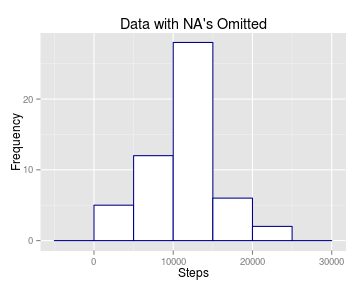
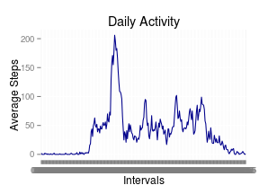
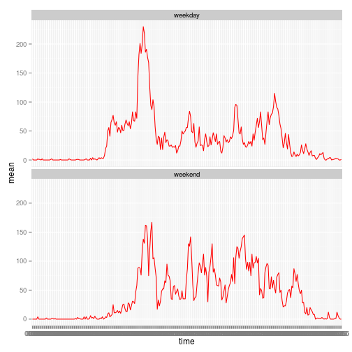

### Initial setup


```r
require(dplyr)
require(tidyr)
require(ggplot2)
require(data.table)
require(xtables)
```

```
## Loading required package: xtables
```

```
## Warning in library(package, lib.loc = lib.loc, character.only = TRUE,
## logical.return = TRUE, : there is no package called 'xtables'
```

```r
require(xtable)
require(lubridate)
options(scipen = 2)
```

### Loading and preprocessing the data
Since I am using a static file, downloaded and unzipped once I am not including downloading the file step.  
I use the data table package since running in tables is faster than running as data frames.

```r
DT <- read.table("activity.csv", sep = ",", header = TRUE)
```
Create time interval using hour and minute

```r
DT1 <- DT %>% 
    mutate(hour = floor(interval / 100)) %>% 
    mutate(min = ifelse(hour < 1, interval, interval - 100 * hour)) %>%
    mutate(hour1 = ifelse(hour < 10, paste0("0", hour, sep = ""), hour)) %>% 
    mutate(min1 = ifelse(min < 10, paste0("0", min, sep = ""), min)) %>% 
    mutate(time = paste(hour1, ":", min1, sep = "")) %>% 
    select(steps, date, time)
```
Delete missing values

```r
DT_comp <- na.omit(DT1)
DT_comp$steps <- as.numeric((DT_comp$steps)) 
```
### What is mean total number of steps taken per day?

```r
dt_summ <- 
    DT_comp %>% 
    group_by(date) %>% 
    summarise(tot = (sum(steps))) %>% 
    ungroup()


sp <- ggplot(dt_summ, aes(x=tot))
sp <- sp + geom_histogram(binwidth = 5000, fill = "white", colour = "darkblue")
sp  + labs(title = "Data with NA's Omitted") + xlab("Steps") + ylab("Frequency")
```

 

```r
max_time <- summarise(DT_comp, max_time = max(DT_comp$steps))
max_time_df <-  filter(DT_comp, steps == max_time$max_time)
max_time_df
```

```
##   steps       date  time
## 1   806 2012-11-27 06:15
```

```r
mean <- prettyNum(mean <- round(mean(dt_summ$tot),0), big.mark = ",")
median <- prettyNum(median <- round(median(dt_summ$tot),0), big.mark = ",")
total <- prettyNum(total <- round(sum(dt_summ$tot),0), big.mark = ",")
```

#### The mean number of steps per day is 10,766. The median number of steps per day is 10,765, and the total number of steps is 570,608.

#### The maximun number of steps taken during one interval is 806 taken during the 06:15 interval, on 2012-11-27.
### What is the average daily activity pattern?

```r
DT_comp %>% 
    group_by(time)
```

```
## Source: local data frame [15,264 x 3]
## Groups: time
## 
##    steps       date  time
## 1      0 2012-10-02 00:00
## 2      0 2012-10-02 00:05
## 3      0 2012-10-02 00:10
## 4      0 2012-10-02 00:15
## 5      0 2012-10-02 00:20
## 6      0 2012-10-02 00:25
## 7      0 2012-10-02 00:30
## 8      0 2012-10-02 00:35
## 9      0 2012-10-02 00:40
## 10     0 2012-10-02 00:45
## ..   ...        ...   ...
```

```r
dt_summ_int <- 
    DT_comp %>% 
    group_by(time) %>% 
    summarise(mean = round((mean(steps)), 0))
dt_summ_int <- tbl_df(dt_summ_int)
sp <- ggplot(dt_summ_int, aes(x=time, y=mean, group=1))
sp <- sp + geom_line(colour = "darkblue")
sp + labs(title = "Daily Activity") + xlab("Intervals") + ylab("Average Steps")
```

 

### Imputing missing values


```r
# Calculate number of missing values.
y <- which(is.na(DT1)==TRUE)
y_len <-  prettyNum(length(y), big.mark = ",")
# Create summary of the mean of the data by time intervals
dt_summ <- 
    DT_comp %>% 
    group_by(time) %>% 
    summarise(mean = mean(steps))
# Create copy of original data and populate NA's with meaan of the interval over the data set.
DT2 <- DT1
DT2$steps[y] <- round(dt_summ$mean[match(dt_summ$time, DT2$time)],0)
dt_summ_new <- 
    DT2 %>% 
    group_by(date) %>% 
    summarise(tot = sum(steps))

sp1 <- ggplot(dt_summ_new, aes(x=tot))
sp1 <- sp1 + geom_histogram(binwidth = 5000, fill = "white", colour = "red")
sp1 <- sp1 +labs(title = "Imputed Data") + xlab("Steps") + ylab("Frequency")

dt_summ <- 
    DT_comp %>% 
    group_by(date) %>% 
    summarise(tot = (sum(steps)))
tot <- sum(dt_summ$tot)
mean <- mean(dt_summ$tot)
median <- median(dt_summ$tot)
old_data <- c(mean, median, tot)
new_tot <- sum(dt_summ_new$tot)
new_mean <- round(mean(dt_summ_new$tot), 0)
new_median <- median(dt_summ_new$tot)
rnames <- tbl_dt(c("mean", "median", "total"))
old_data <- c(mean, median, tot)
new_data <- c(new_mean, new_median, new_tot)
new_data <- tbl_dt(new_data)
old_data <- tbl_dt(old_data)
rnames <- tbl_dt(c("mean", "median", "total"))
new_tbl <- bind_cols(rnames, old_data, new_data)
names(new_tbl) <- c("Value", "Omitted", "Imputed")
# new_tbl <- as.data.frame(new_tbl)
ptable <- xtable(new_tbl, format = "html", digits=0, caption = c("Comparision of omitted vs. imputted values"))
sp1
```

 

##### The number of NA's in the original data set is 2,304, new mean 10766, new median 10762, new total 656704

```r
print(ptable, type = "html", include.rownames = FALSE)
```

<!-- html table generated in R 3.2.0 by xtable 1.7-4 package -->
<!-- Wed Jun 10 22:03:47 2015 -->
<table border=1>
<caption align="bottom"> Comparision of omitted vs. imputted values </caption>
<tr> <th> Value </th> <th> Omitted </th> <th> Imputed </th>  </tr>
  <tr> <td> mean </td> <td align="right"> 10766 </td> <td align="right"> 10766 </td> </tr>
  <tr> <td> median </td> <td align="right"> 10765 </td> <td align="right"> 10762 </td> </tr>
  <tr> <td> total </td> <td align="right"> 570608 </td> <td align="right"> 656704 </td> </tr>
   </table>

##### To replace the omitted data I used the mean data collected for each interval.  When placing this data in the data table it doesn't affect the mean at all, it only affects the median slightly, but it has a huge effect on the total number of steps taken over the period.  Adding a small data value to the missing values (2,304 NA's) increases the total number of steps taken.

### Are there differences in activity patterns between weekdays and weekends?

```r
dt3 <- DT2
dt3$date <- ymd(dt3$date)
dt3 <- dt3 %>%
    mutate(wd = wday(date))

dt3 <- dt3 %>% 
    mutate(wdind = ifelse((wd == 7 | wd == 1), "weekend", "weekday"))
dt3_summ <- dt3 %>% 
    group_by(wdind, time) %>% 
    summarise(mean = round(mean(steps),0))
dt3_summ <- group_by(dt3_summ, wdind)
sp <- ggplot(dt3_summ, aes(x=time, y=mean, group=wdind)) + geom_line(col = "red")
sp <- sp + facet_wrap( ~ wdind, ncol=1)
sp
```

 

Three of the principal differences between weekdays and weekends are:

1. Wakes later
1. Doesn't have as dramatic an early spike
1. Goes to bed earlier
